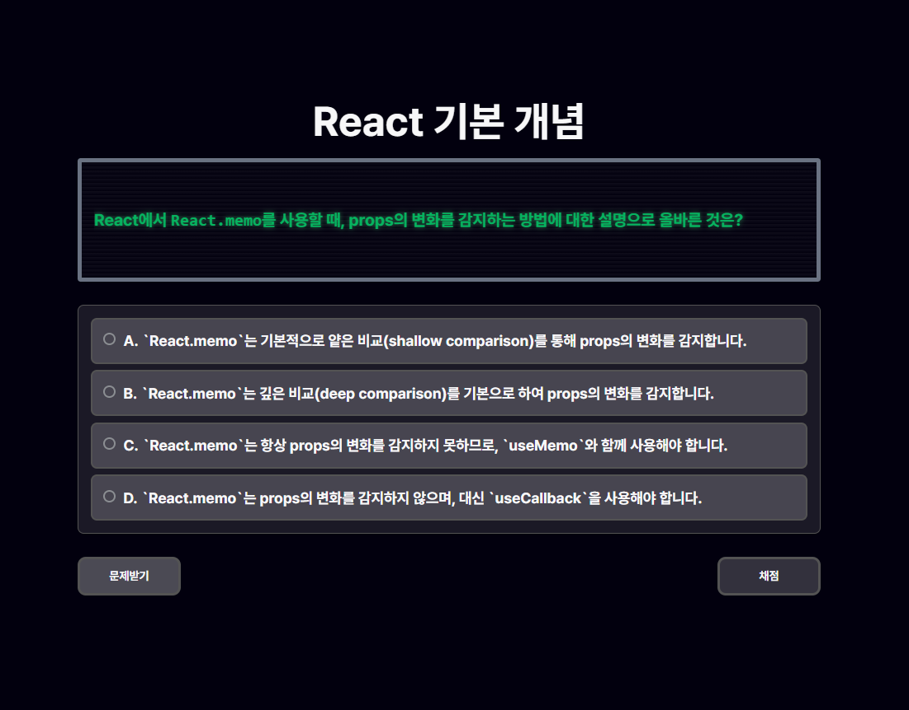
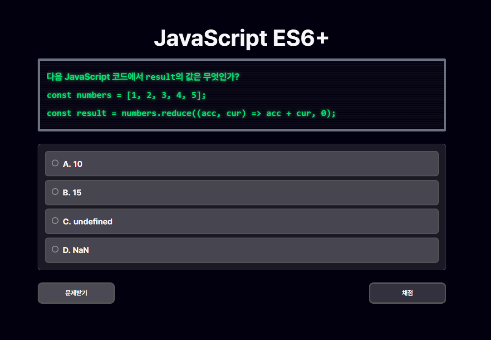
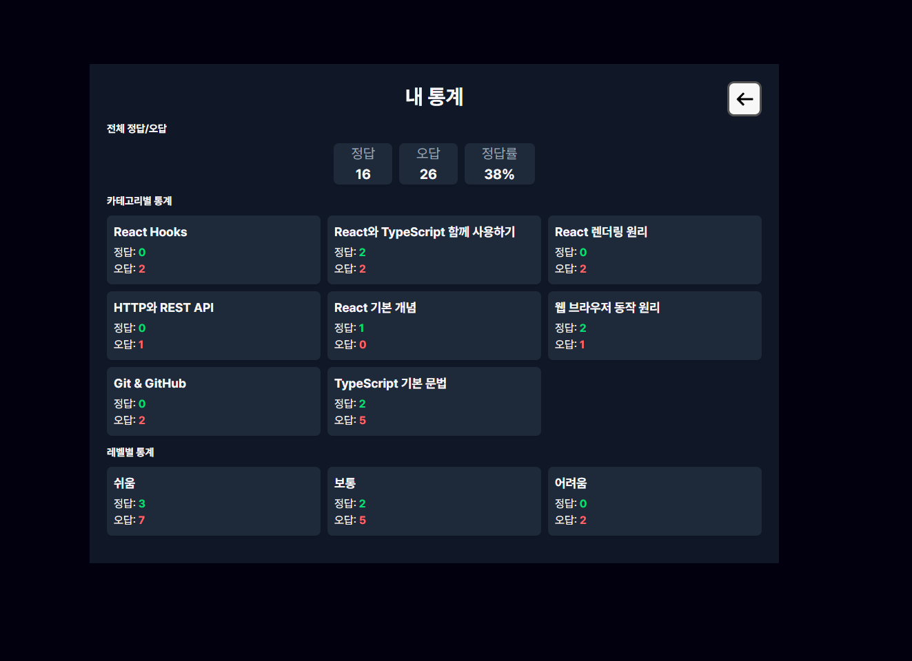
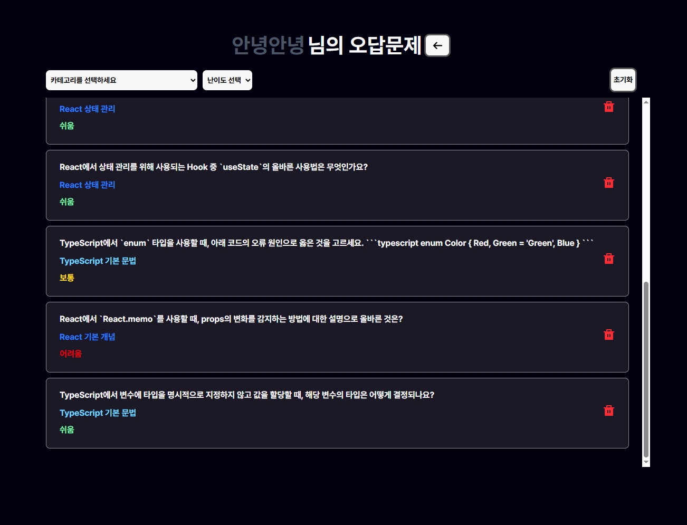
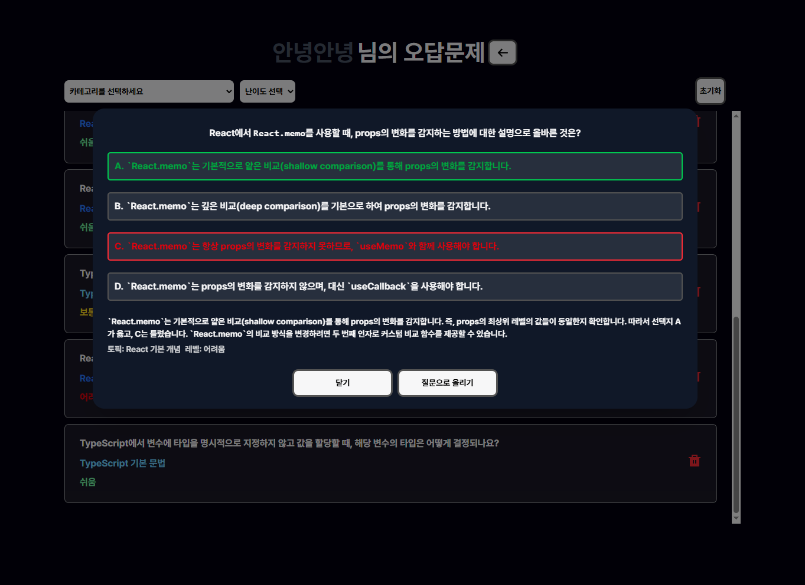
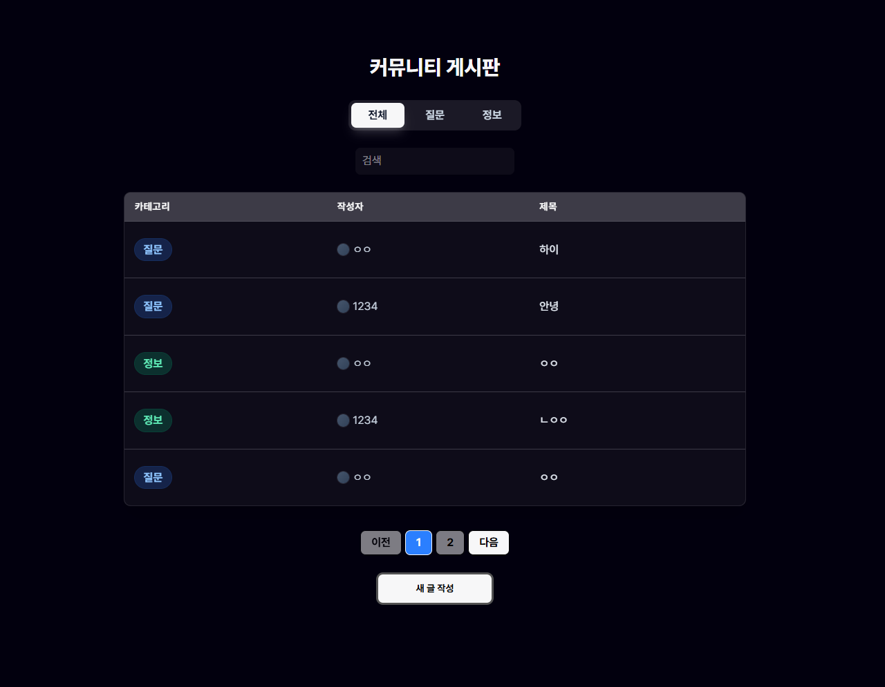
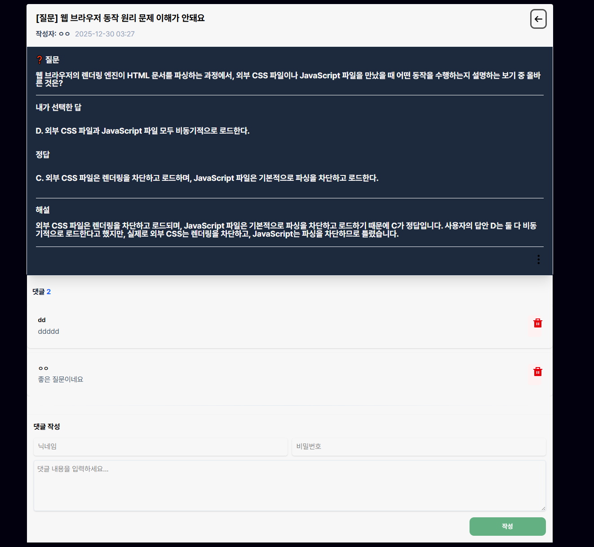

# FrontQuiz

프론트엔드 개발자를 위한 퀴즈 학습 플랫폼

JavaScript, React, TypeScript 등 다양한 기술 스택에 대한 퀴즈를 풀고, 학습 통계를 확인하며, 커뮤니티에서 정보를 공유할 수 있는 웹 애플리케이션입니다.

---

## 배포사이트

[사이트로 이동하기](https://www.front-quiz-pro.store/)

## ✨ 주요 기능

- 퀴즈 : 카테고리별,난이도별 퀴즈를 제공받아 풀기, 채점 및 해설기능

- 커뮤니티 : 질문,정보글 등록 및 댓글시스템

- 마이페이지 : 유저정보 수정 , 풀었던문제 통계확인 , 오답노트에 저장한 문제 확인 및 오답문제를 커뮤니티에 질문글로 올리기

## ✨ 적용한 기술

- FallBackUI 및 SkeletonUI, ErrorBoundary를 사용한 UX 개선

- 페이지별 Tanstack Query를 사용한 데이터 패칭 및 캐싱을 사용한 성능최적화 및 useInfinite Query를 사용한 무한스크롤 구현

- OAuth 2.0기반 카카오 소셜 로그인(JWT기반) -> zustand Persist를 사용한 로그인유지

- 백엔드단 프롬프트 엔지니어링을 통해 텍스트를 일관된 JSON 스키마로 응답받도록 설계하여 Meta Llama 기반 퀴즈 생성 시스템 구축

### 1. 퀴즈 풀기

<p align="center">
  
  
  
</p>

#### meta-llama/llama-4-maverick 모델을 사용하여 문제를 AI를 통해 생성 및 채점

- 다양한 프론트엔드 토픽 선택후 문제풀기 (React, TypeScript, JavaScript 등)

- 난이도를 선택가능하여 난이도별 퀴즈 제공

- 채점 및 해설제공

- 오답문제 저장 기능을 통해 마이페이지에서 확인가능

### 2. 마이페이지 풀었던 문제 통계



- 전체/카테고리별/난이도별 통계 확인

### 3. 마이페이지 오답노트

<p align="center">
  
  
</p>

- 저장된 오답문제의 내가 선택했던 답, 정답 , 해설을 확인가능

- 카테고리 및 난이도별 필터링

- 오답 삭제 기능

- 오답문제를 질문템플릿 유틸함수를 통해 바로 커뮤니티에 질문으로 올리기 가능

### 4. 마이페이지 유저정보수정

- 닉네임 및 프로필이미지 변경기능

### 5. 커뮤니티

<p align="center">
  
  
</p>

- 게시글 작성/수정/삭제

- 댓글 작성/삭제

- 정보/질문 카테고리별 게시글 필터링

- Debounce를 적용한 검색 기능

## 🛠 기술 스택

### Core

- **React 19** - UI 라이브러리

- **TypeScript** - 타입 안정성

- **Vite** - 빌드 도구 및 개발 서버

### 라우팅

- **React Router v7** - 클라이언트 사이드 라우팅

### 상태 관리

- **Zustand** - 경량 전역 상태 관리

- **TanStack React Query v5** - 서버 상태 관리 및 캐싱

### HTTP 클라이언트

- **Axios** - HTTP 요청 처리

### 스타일링

- **Tailwind CSS v4** - 유틸리티 기반 CSS 프레임워크

- **Motion (Framer Motion)** - 애니메이션 라이브러리

### 폼 관리

- **React Hook Form** - 폼 상태 관리 및 유효성 검사

### 기타

- **React Markdown** - 마크다운 렌더링

- **Rehype Highlight** - 코드 하이라이팅

## 📁 프로젝트 구조

```

front-quiz/

├── src/

│   ├── apis/              # API 인스턴스

│   │   ├── instance.ts           # Public API

│   │   ├── privateInstance.ts    # Private API (인증 필요)

│   │   └── kakaoAuthInstance.ts  # Kakao OAuth

│   ├── assets/            # 정적 리소스

│   ├── components/        # 공통 컴포넌트

│   │   ├── ui/            # UI 컴포넌트

│   │   ├── Modal/         # 모달 컴포넌트

│   │   ├── Dropdown/      # 드롭다운 컴포넌트

│   │   └── ...

│   ├── constants/         # 상수 정의

│   ├── contexts/          # React Context

│   ├── features/          # 기능별 모듈

│   │   ├── quizComp/      # 퀴즈 기능

│   │   ├── Community/     # 커뮤니티 기능

│   │   └── myPage/        # 마이페이지 기능

│   ├── hooks/             # 커스텀 훅

│   ├── page/              # 페이지 컴포넌트

│   ├── store/             # Zustand 스토어

│   ├── types/             # TypeScript 타입 정의

│   ├── utils/             # 유틸리티 함수

│   ├── App.tsx            # 라우팅 설정

│   └── main.tsx           # 진입점

├── public/                # 정적 파일

└── package.json

```
